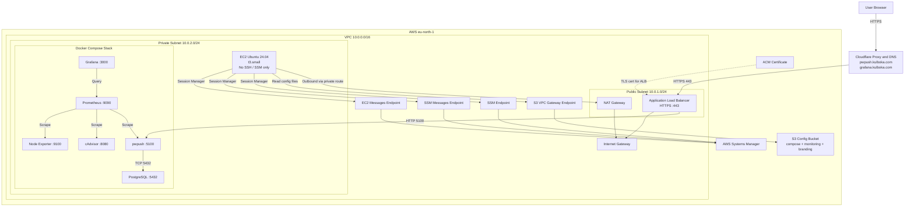

# Networking Diagram — Password Pusher Final Project

## Mermaid Diagram

## Short Explanation

- Users access the application through **Cloudflare**.
- Cloudflare forwards HTTPS traffic to the **AWS Application Load Balancer**.
- The ALB sends application traffic to **Password Pusher** running on a private **EC2** instance.
- The EC2 instance is not publicly reachable and is managed through **AWS Systems Manager**, not SSH.
- The application uses **PostgreSQL** internally and exposes monitoring through **Prometheus** and **Grafana**.
- The private EC2 instance downloads deployment configuration from **S3** through an **S3 VPC endpoint**.
- Outbound internet access for the private subnet goes through the **NAT Gateway**.
