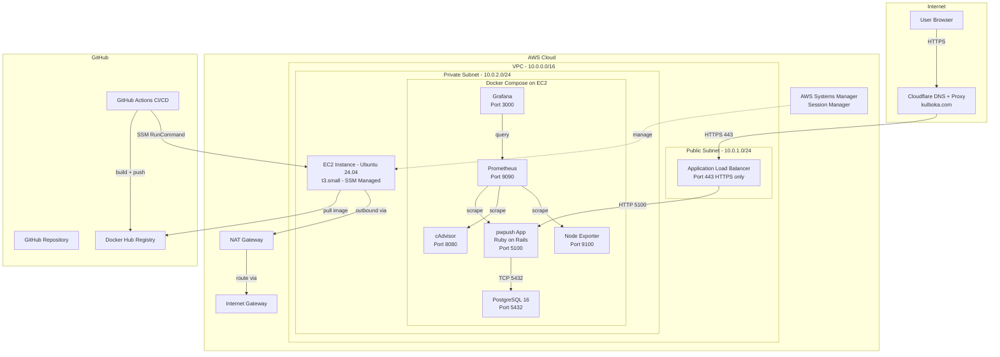
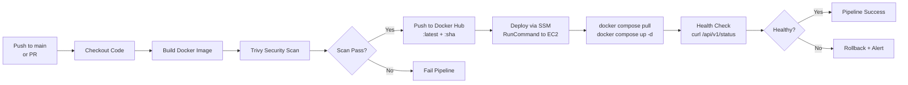

# Final Project Plan: Password Pusher (pwpush) — DevOps Deployment

## Project Overview

Deploy a self-hosted, customized version of **Password Pusher (pwpush)** on AWS using Infrastructure as Code, CI/CD automation, security best practices, and full observability — targeting the maximum 140-point score on the DevOps course rubric.

---

## Architecture Diagram



---

## CI/CD Pipeline Flow



---

## Component Breakdown

### 1. Application — Password Pusher

| Aspect | Detail |
|--------|--------|
| Base repo | [pglombardo/PasswordPusher](https://github.com/pglombardo/PasswordPusher) |
| Action | Fork → customize branding/UI → build custom Docker image |
| Runtime | Ruby on Rails |
| Database | PostgreSQL 16 |
| Customizations | Logo, colors, footer text, page title — satisfies Develop/Adapt App criteria |

### 2. Infrastructure — Terraform on AWS + Cloudflare

| Resource | Purpose |
|----------|---------|
| VPC + Subnets | Isolated network: 1 public subnet for ALB, 1 private subnet for EC2 |
| Internet Gateway | Outbound for ALB |
| NAT Gateway + EIP | Outbound internet for private EC2 to pull Docker images |
| Application Load Balancer | HTTPS termination on port 443, forwards to pwpush on 5100 |
| ACM Certificate | SSL cert for kulboka.com validated via Cloudflare DNS |
| EC2 Instance | t3.small Ubuntu 24.04 in private subnet, SSM-managed, no SSH |
| Security Groups | ALB SG: inbound 443 only; EC2 SG: inbound from ALB SG only + all outbound |
| IAM Role + Instance Profile | SSM access + Docker Hub pull permissions |
| SSM | Session Manager for shell access — port 22 completely closed |
| S3 Backend | Terraform remote state storage with native S3 locking (`use_lockfile = true`) |
| **Cloudflare DNS Record** | CNAME `pwpush.kulboka.com` → ALB DNS name, proxied, automated via Terraform |
| **Cloudflare ACM Validation** | DNS validation record for ACM cert, automated via Terraform |

#### Cloudflare Terraform Provider

The [`cloudflare/cloudflare`](https://registry.terraform.io/providers/cloudflare/cloudflare/latest) provider automates DNS management — no manual Cloudflare dashboard steps needed.

**How it works:**
1. Terraform creates the ALB and gets its DNS name as an output
2. Terraform creates an ACM certificate for `pwpush.kulboka.com`
3. Terraform creates the DNS validation CNAME in Cloudflare for ACM to verify domain ownership
4. ACM validates and issues the certificate
5. Terraform creates the proxied CNAME record `pwpush.kulboka.com` → ALB DNS name
6. Cloudflare SSL mode set to **Full Strict** — end-to-end encryption

**Required credentials:**
- `CLOUDFLARE_API_TOKEN` — scoped to Zone:DNS:Edit for `kulboka.com`
- `CLOUDFLARE_ZONE_ID` — zone ID for `kulboka.com` from Cloudflare dashboard

### 3. Docker Compose Stack

Services running on the EC2 instance:

| Service | Image | Port | Network |
|---------|-------|------|---------|
| pwpush | custom-built from fork | 5100 | frontend + backend |
| postgres | postgres:16-alpine | 5432 | backend only |
| prometheus | prom/prometheus:latest | 9090 | frontend + monitoring |
| grafana | grafana/grafana:latest | 3000 | frontend + monitoring |
| cadvisor | gcr.io/cadvisor/cadvisor | 8080 | monitoring |
| node-exporter | prom/node-exporter | 9100 | monitoring |

**Docker Networks:**
- `frontend` — pwpush, prometheus, grafana accessible from ALB
- `backend` — pwpush ↔ postgres only, isolated from internet
- `monitoring` — prometheus, grafana, cadvisor, node-exporter

### 4. CI/CD — GitHub Actions

**Workflow triggers:**
- Push to `main` branch with path filter on `final-project/**`
- Pull request for validation only — no deploy
- Manual `workflow_dispatch`

**Pipeline stages:**
1. **Lint** — Hadolint for Dockerfile, yamllint for compose/workflows
2. **Build** — `docker build` with buildx, multi-platform optional
3. **Scan** — Trivy container image scan, fail on HIGH/CRITICAL
4. **Push** — Docker Hub with tags `:latest` and `:$GITHUB_SHA`
5. **Deploy** — AWS SSM `SendCommand` to EC2 to pull and restart
6. **Test** — Post-deploy health check via curl through the ALB endpoint

**Required GitHub Secrets:**
| Secret | Purpose |
|--------|---------|
| `DOCKER_USERNAME` | Docker Hub login — already configured |
| `DOCKER_PASSWORD` | Docker Hub token — already configured |
| `AWS_ROLE_ARN` | OIDC role for Terraform + SSM — already configured |
| `EC2_INSTANCE_ID` | Target EC2 for SSM RunCommand |
| `APP_DOMAIN` | kulboka.com or subdomain |
| `CLOUDFLARE_API_TOKEN` | Cloudflare API token scoped to Zone:DNS:Edit |
| `CLOUDFLARE_ZONE_ID` | Cloudflare zone ID for kulboka.com |
| `DB_PASSWORD` | PostgreSQL password |
| `PWPUSH_SECRET_KEY_BASE` | Rails secret key |

### 5. Security Measures

| Measure | Implementation |
|---------|---------------|
| No SSH | Port 22 closed; access via AWS SSM Session Manager only |
| HTTPS only | ALB terminates TLS with ACM cert; Cloudflare proxy adds WAF |
| Private DB network | PostgreSQL on isolated Docker backend network, no port exposure |
| Secret management | GitHub Secrets → SSM Parameter Store → .env on EC2 |
| Image scanning | Trivy in CI pipeline, fail on HIGH/CRITICAL vulnerabilities |
| Least privilege SG | EC2 SG allows inbound only from ALB SG |
| IAM least privilege | Instance profile with only SSM + Docker Hub pull permissions |
| Cloudflare proxy | Hides origin IP, provides DDoS protection + WAF |

### 6. Observability — Prometheus + Grafana

| Component | Role |
|-----------|------|
| Prometheus | Scrapes metrics from pwpush, cAdvisor, node-exporter |
| Grafana | Dashboards for container metrics, host metrics, app health |
| cAdvisor | Container-level CPU, memory, network, disk metrics |
| Node Exporter | Host-level system metrics |
| Health checks | Automated curl in CI + Docker healthcheck directives |

**Grafana Dashboards:**
- Docker Container Monitoring — dashboard ID 193
- Node Exporter Full — dashboard ID 1860
- Custom pwpush health dashboard

### 7. DNS — Cloudflare (Automated via Terraform)

All Cloudflare DNS changes are **fully automated** via the `cloudflare/cloudflare` Terraform provider — no manual dashboard steps required.

| Record | Type | Value | Proxy | Managed By |
|--------|------|-------|-------|------------|
| pwpush.kulboka.com | CNAME | ALB DNS name | Proxied — orange cloud | Terraform |
| _acm-validation.pwpush.kulboka.com | CNAME | ACM validation value | DNS only | Terraform |

Cloudflare provides:
- DNS resolution — automated record creation via Terraform
- TLS termination at edge — Full Strict mode with ACM cert on ALB
- DDoS protection
- WAF rules
- Origin IP hiding

---

## Project Directory Structure

```
final-project/
├── README.md                          # Project documentation
├── .env.example                       # Template for environment variables
├── docker-compose.yml                 # Multi-container orchestration
├── docker-compose.monitoring.yml      # Monitoring stack override
├── Dockerfile                         # Custom pwpush image build
├── terraform/
│   ├── provider.tf                    # AWS provider + S3 backend
│   ├── variables.tf                   # Input variables
│   ├── outputs.tf                     # Outputs - ALB DNS, EC2 ID
│   ├── vpc.tf                         # VPC, subnets, IGW, NAT
│   ├── security-groups.tf             # ALB SG, EC2 SG
│   ├── iam.tf                         # SSM role, instance profile
│   ├── ec2.tf                         # EC2 instance + user data
│   ├── alb.tf                         # ALB, target group, listener
│   ├── acm.tf                         # SSL certificate
│   ├── cloudflare.tf                  # DNS records + ACM validation via CF API
│   ├── ssm.tf                         # SSM parameters for secrets
│   └── terraform.tfvars.example       # Example variable values
├── monitoring/
│   ├── prometheus/
│   │   └── prometheus.yml             # Scrape config
│   └── grafana/
│       └── provisioning/
│           ├── datasources/
│           │   └── prometheus.yml     # Auto-configure Prometheus DS
│           └── dashboards/
│               ├── dashboard.yml      # Dashboard provisioning config
│               └── docker-monitoring.json  # Pre-built dashboard
├── scripts/
│   ├── deploy.sh                      # Deployment script for SSM
│   ├── health-check.sh                # Post-deploy health verification
│   └── setup-ec2.sh                   # EC2 user-data bootstrap script
├── tests/
│   └── test_health.py                 # pytest health check tests
└── .github/
    └── workflows/
        └── deploy-pwpush.yml          # Full CI/CD pipeline
```

---

## Grading Rubric Coverage

| Rubric Item | How It Is Addressed | Points |
|-------------|-------------------|--------|
| Develop/Adapt App | Fork pwpush, customize branding/UI | ✅ |
| Dockerize | Custom Dockerfile, multi-container docker-compose | ✅ |
| IaC with Terraform | Full AWS infra: VPC, EC2, ALB, SG, IAM, ACM | ✅ |
| CI/CD Pipeline | GitHub Actions: build → scan → push → deploy → test | ✅ |
| Security Scanning | Trivy in pipeline, fail on HIGH/CRITICAL | ✅ |
| Secret Management | GitHub Secrets → SSM Parameter Store → .env | ✅ |
| Cloud Security Groups | Restrictive SGs: ALB 443 only, EC2 from ALB only, no SSH | ✅ |
| Private Docker Network | PostgreSQL on isolated backend network | ✅ |
| Monitoring + Logging | Prometheus + Grafana + cAdvisor + Node Exporter | ✅ |
| Automated Testing | Post-deploy health checks via curl + pytest | ✅ |
| Documentation | Comprehensive README with architecture diagrams | ✅ |

---

## Implementation Order

1. **Fork and customize pwpush** — Create fork, modify branding files, write Dockerfile
2. **Docker Compose** — Local development stack with pwpush + PostgreSQL
3. **Add monitoring** — Prometheus, Grafana, cAdvisor, Node Exporter
4. **Terraform infrastructure** — VPC → SG → IAM → EC2 → ALB → ACM → SSM
5. **EC2 bootstrap script** — Install Docker, Docker Compose, configure SSM agent
6. **GitHub Actions pipeline** — Build → Scan → Push → Deploy → Test
7. **Cloudflare DNS** — Point subdomain to ALB, enable proxy
8. **Health checks and tests** — Automated verification scripts
9. **Documentation** — README with setup, architecture, and usage instructions
10. **Final testing** — End-to-end pipeline run and verification
